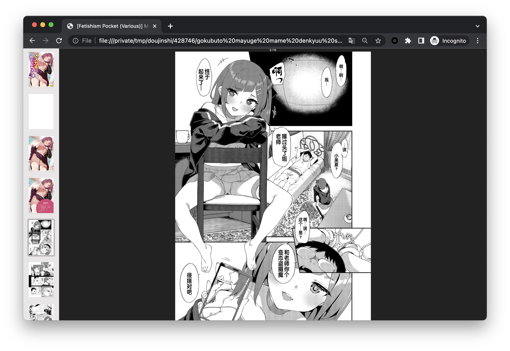

nhentai
=======
           _   _            _        _
     _ __ | | | | ___ _ __ | |_ __ _(_)
    | '_ \| |_| |/ _ \ '_ \| __/ _` | |
    | | | |  _  |  __/ | | | || (_| | |
    |_| |_|_| |_|\___|_| |_|\__\__,_|_|

あなたも変態。 いいね?  
[](https://travis-ci.org/RicterZ/nhentai)   


nHentai is a CLI tool for downloading doujinshi from [nhentai.net](http://nhentai.net).

### Installation

    git clone https://github.com/RicterZ/nhentai
    cd nhentai
    python setup.py install
    
### Gentoo

    layman -fa glicOne
    sudo emerge net-misc/nhentai

### Usage
Download specified doujinshi:
```bash
nhentai --id=123855,123866
```

Search a keyword and download the first page:
```bash
nhentai --search="tomori" --page=1 --download
```

Download your favourite doujinshi (login required):
```bash
nhentai --login "username:password" --download
```

Download by tag name:
```bash
nhentai --tag lolicon --download
```

### Options

+ `-t, --thread`: Download threads, max: 10  
+ `--output`:Output dir of saving doujinshi  
+ `--tag`:Download by tag name  
+ `--timeout`: Timeout of downloading each image   
+ `--proxy`: Use proxy, example: http://127.0.0.1:8080/  
+ `--login`: username:password pair of your nhentai account  
+ `--nohtml`: Do not generate HTML  
+ `--cbz`: Generate Comic Book CBZ File  

### nHentai Mirror
If you want to use a mirror, you should set up a reverse proxy of `nhentai.net` and `i.nhentai.net`.
For example:

    i.h.loli.club -> i.nhentai.net
    h.loli.club -> nhentai.net

Set `NHENTAI` env var to your nhentai mirror.
```bash
NHENTAI=http://h.loli.club nhentai --id 123456
```

  
  
  

### License  
MIT

### あなたも変態

