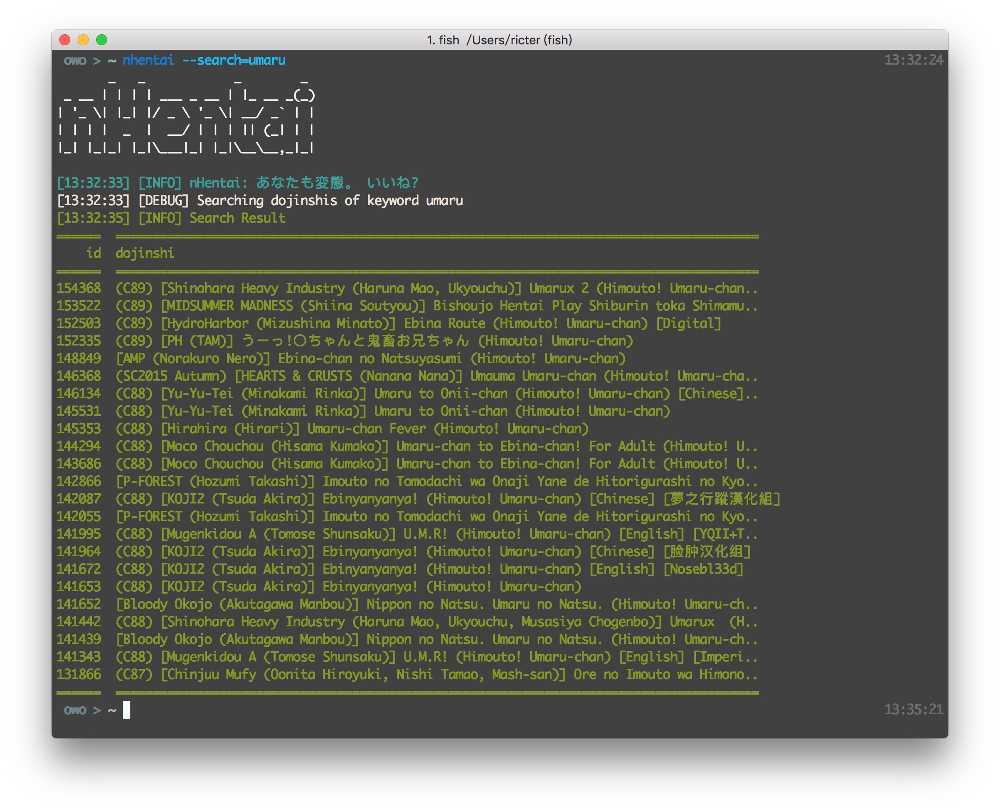
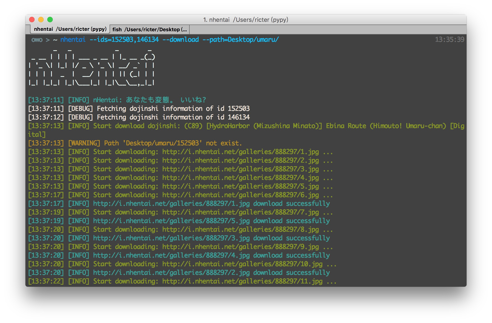

nhentai
=======
           _   _            _        _
     _ __ | | | | ___ _ __ | |_ __ _(_)
    | '_ \| |_| |/ _ \ '_ \| __/ _` | |
    | | | |  _  |  __/ | | | || (_| | |
    |_| |_|_| |_|\___|_| |_|\__\__,_|_|

あなたも変態。 いいね?  
  

🎉🎉 nhentai 现在支持 Windows 啦！

由于 [http://nhentai.net](http://nhentai.net) 下载下来的种子速度很慢，而且官方也提供在线观看本子的功能，所以可以利用本脚本下载本子。
### 安装

    git clone https://github.com/RicterZ/nhentai
    cd nhentai
    python setup.py install
    

### 用法
+ 下载指定 id 列表的本子：

    nhentai --id=123855,123866
    

+ 下载某关键词第一页的本子（不推荐）：

    nhentai --search="tomori" --page=1 --download

`-t, --thread`：指定下载的线程数，最多为 10 线程。  
`--path`：指定下载文件的输出路径，默认为当前目录。  
`--timeout`：指定下载图片的超时时间，默认为 30 秒。  
`--proxy`：指定下载的代理，例如: http://127.0.0.1:8080/

### 自建 nhentai 镜像
如果想用自建镜像下载 nhentai 的本子，需要搭建 nhentai.net 和 i.nhentai.net 的反向代理。  
例如用 h.loli.club 来做反向代理的话，需要 h.loli.club 反代 nhentai.net，i.h.loli.club 反带 i.nhentai.net。  
然后利用环境变量来下载：  

    NHENTAI=http://h.loli.club nhentai --id 123456

  
  

### License  
MIT

### あなたも変態

